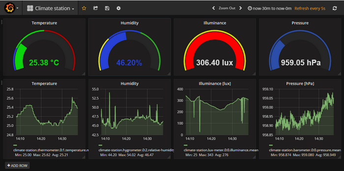

# Grafana + InfluxDB

<!-- toc -->

## Instalace

Návod je pro os Debian a Raspbian Jessie a Ubuntu Xenial

Testováno na:

* Raspbian Jessie na Raspberry Pi 3
* Ubuntu Xenial jako lxc kontejner na Turris Omnia

### InfluxDB

* Install dependencies
  ```
  sudo apt install apt-transport-https curl -y
  ```

* Přidání klíče repozitáře
  ```
  curl -sL https://repos.influxdata.com/influxdb.key | sudo apt-key add -
  ```

* Přidání repozitáře

  * Debian (Raspbian) Jessie
    ```
    echo "deb https://repos.influxdata.com/debian jessie stable" | sudo tee /etc/apt/sources.list.d/influxdb.list
    ```
  * Ubuntu Xenial
    ```
    echo "deb https://repos.influxdata.com/ubuntu/ xenial stable" | sudo tee /etc/apt/sources.list.d/influxdb.list
    ```

* Aktualizace a instalace
  ```
  sudo apt update && sudo apt install influxdb
  ```

* Zpustíme
  ```
  sudo systemctl start influxdb
  ```

  > **Poznámka:** Pokud chceš administrovat influx přes http tak v `/etc/influxdb/influxdb.conf` odkomentuj a uprav `enabled = true` a `bind-address = ":8083"`

### Grafana

* Install dependencies
  ```
  sudo apt install adduser libfontconfig -y
  ```

* Vyber si podle architektury

  * Raspberry Pi a Omnia lxc

    * Stažení deb balíčku (ten ošklivý příkaz si najde poslední relase) nebo si jej stáhněte ručně z [https://github.com/fg2it/grafana-on-raspberry/releases/latest](https://github.com/fg2it/grafana-on-raspberry/releases/latest)
    ```
    wget $(wget "https://api.github.com/repos/fg2it/grafana-on-raspberry/releases/latest" -q -O - | grep browser_download_url | grep armhf.deb | head -n 1 | cut -d '"' -f 4) -O grafana.deb
    ```

    * Instalace
    ```
    sudo dpkg -i grafana.deb
    ```

  * x86-64
    * Přidání klíče repozitáře
      ```
      curl -sL https://packagecloud.io/gpg.key | sudo apt-key add -
      ```
    * Přidání repozitáře
      ```
      echo "deb https://packagecloud.io/grafana/stable/debian/ jessie main" | sudo tee /etc/apt/sources.list.d/grafana.list
      ```
    * Aktualizace a instalace
      ```
      sudo apt update && sudo apt install grafana -y
      ```

* Reload systemd:
  ```
  sudo systemctl daemon-reload
  ```

* Zapnuti spuštění grafany po bootu
  ```
  sudo systemctl enable grafana-server
  ```

* Zpustíme
  ```
  sudo systemctl start grafana-server
  ```

### MQTT brouker

Existuje jich víc, my používáme Mosquitto

```
sudo apt install mosquitto mosquitto-clients -y
```

### Gateway mezi USB serial a MQTT brokerem

* Install dependencies
  ```
  sudo apt install python3 python3-pip python3-docopt python3-serial
  sudo -H pip3 install paho-mqtt
  ```
  > **Help:** Pokud pip3 skončí chybou `locale.Error: unsupported locale setting` spust `sudo sh -c "echo LC_ALL=C >> /etc/default/locale"` a opakuj příkaz s pip3

* Stažení Gateway z Githubu
  ```
  sudo wget "https://raw.githubusercontent.com/bigclownlabs/bch-gateway/master/bc-gateway.py" -O /usr/bin/bc-gateway
  ```

* Povolíme zpouštění
  ```
  sudo chmod +x /usr/bin/bc-gateway
  ```

* Nakonfigurujem službu pro systemd
  ```
  sudo sh -c 'echo "[Unit]
  Description=BigClown gateway between USB and MQTT broker
  [Service]
  ExecStart=/usr/bin/bc-gateway -d /dev/ttyACM0
  User=root
  Restart=on-failure
  RestartSec=10s
  [Install]
  WantedBy=multi-user.target
  " > /etc/systemd/system/bc-gateway.service'
  ```

* Reload systemd:
  ```
  sudo systemctl daemon-reload
  ```

* Zapnuti spuštění grafany po bootu
  ```
  sudo systemctl enable bc-gateway.service
  ```

* Zpustíme
  ```
  sudo systemctl start bc-gateway.service
  ```

### Gateway mezi MQTT a InfluxDB

* Vytvoření databáze jménem `node` v InfluxDB
  ```
  curl --data "q=CREATE+DATABASE+%22node%22&db=_internal" http://localhost:8086/query
  ```

* Install dependencies
  ```
  sudo -H pip3 install influxdb
  ```

* Stažení Gateway z Githubu
  ```
  sudo wget "https://raw.githubusercontent.com/bigclownlabs/bcp-climate-station/master/hub/mqtt_to_influxdb.py" -O /usr/bin/mqtt_to_influxdb
  ```

* Stažení a úprava konfiguračního souboru pro systemd
  ```
  sudo sh -c "curl -sL https://raw.githubusercontent.com/bigclownlabs/bcp-climate-station/master/hub/mqtt_to_influxdb.service | sed -e 's/User=bigclown/User=root/' > /etc/systemd/system/mqtt_to_influxdb.service"
  ```
* Povolíme zpouštění
  ```
  sudo chmod +x /usr/bin/mqtt_to_influxdb
  ```

* Reload systemd:
  ```
  sudo systemctl daemon-reload
  ```

* Zapnuti spuštění grafany po bootu
  ```
  sudo systemctl enable mqtt_to_influxdb.service
  ```

* Zpustíme
  ```
  sudo systemctl start mqtt_to_influxdb.service
  ```

### Nastavení Grafany

* Připoj se na Grafanu [http://<ip>:3000](http://<ip>:3000)  User `admin` a Password `admin`

* Vytvoření datasource

  * Klikneme na `Add data source` a vyplníme následující hodnoty:
    * Name: node
    * Type: InfluxDB
    * Url: http://localhost:8086
    * Database: node

  * Klikneme na `Add`, Grafana se pokusí připojit na InfluxDB - úspěch oznámí takovouto hláškou `Data source is working`

* Import dashboardu

  * Vlevo nahoře klikneme na ikonku Grafany, vybereme `Dashboard` a `Import`

  * Stáhněte si do počítače soubor s dashboardem

  * Vybereme možnost `Upload .json File` a vybereme stažený json file, teď už jen zvolíme `node` ze seznamu dostupných datasource, to je ten, který jsme si před chvílí vytvořili.

  * A klikneme na `Import`

  * Nyní bys měl vidět naměřené hodnoty.

  


