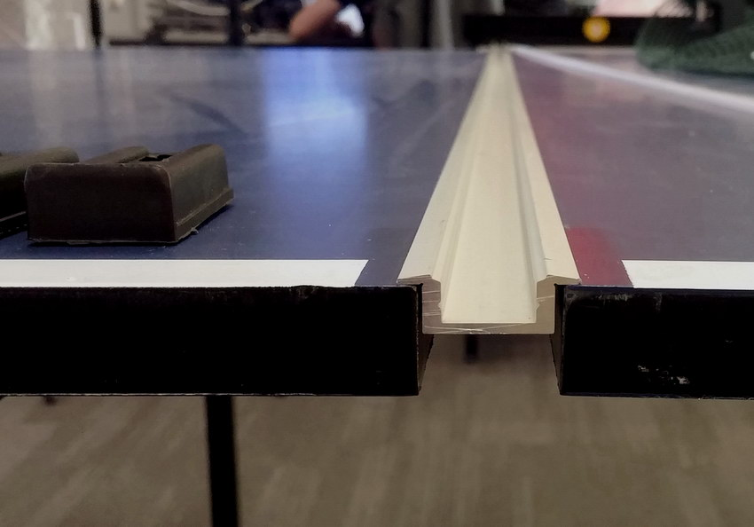
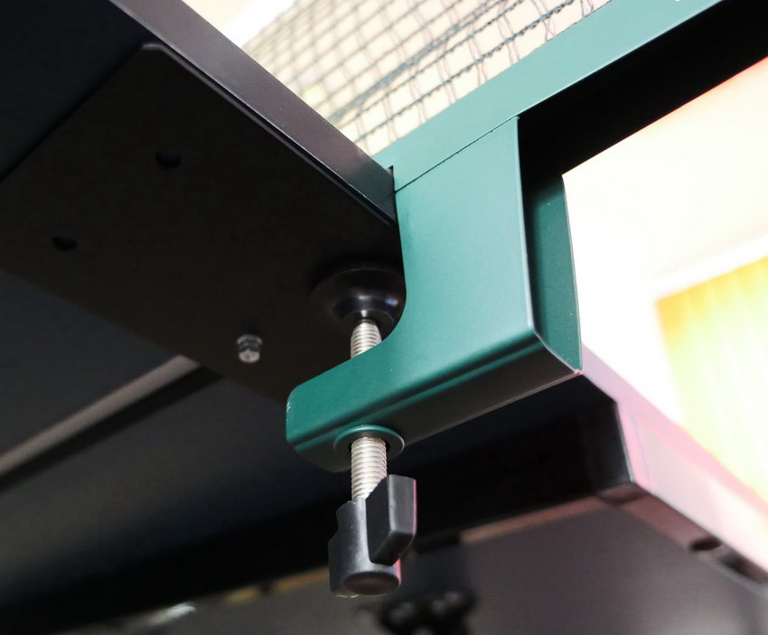
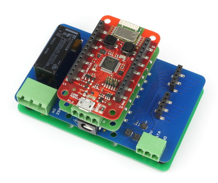
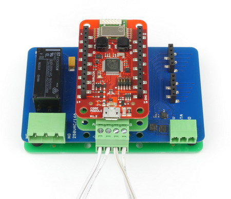
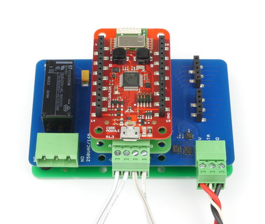

# Ping-pong

## O čem projekt je a co ti přinese

 Velmi jednoduchý projekt, který velice originálně řeší problémy s počítáním bodů při hraní stopního tenisu. V podstatě se jedná o počítadlo na body, které se inkrementuje pokaždé, když jeden, nebo druhý hráč získá bod a po dosažení 21 bodů oznámí vítěze. Výsledkem je unikátní pingpongový stůl, který vždy dokáže minimálně rozproudit konverzaci návštěvníků v našich kancelářích, protože je jediný svého druhu… zatím.

 


## Co všechno k projektu potřebuješ

* 1x LED pásek
* 1x Core Module
* 1x Power Module
* 1x Base Module
* 1x Sensor Module

Dále budeš potřebovat:

* PC nebo notebook s Windows, MacOS nebo Linux
* Napájecí adaptér
* Tlačítka
* Několik metrů dvou-žilového vodiče


## Jak na to

### Příprava stolu :

Mechanika celého problému by se dala shrnout asi tak, že výrobce stolu snad počítal s tím, že se tam bude pásek instalovat, jelikož byl celý zákrok neinvazivní, ale výsledek je i přesto velice robustní. Zápustný hliníkový profil perfektně zapadne do mezery mezi polovinami stolu.

 1. Seřízni zápustný ALU profil přesně na šířku ping-pongového stolu.

 

 2. Do profilu vyvrtej na krajích dva otvory pro šroub se zápustnou hlavou, tak aby bylo možné na spodní stranu stolu přiložit plechy pro ukotvení. Jejich přesná velikost není nijak kritická. Po upnutí plechu pomocí rychloupínacího držáku na síťku se obě hrací plochy stolu pevně spojí.

 

 3. Nakonec se po stranách připevní tlačítka s kabelem dostatečné délky.

 

### Složení stavebnice
 1. Sestav Node z modulů BigClown.

 

2. <a href="https://github.com/bigclownlabs/doc.bigclown.cz/raw/ping-pong/docs/images/ping-pong/ppv0_1.bin"> Sáhni si zkompilovaný firmware
</a> k projektu (podrobněji viz dole).

3. <a href="https://doc.bigclown.cz/core-module-flashing.html"> Flashni Core Module </a> pomocí micro USB kabelu a dfu [podle tohoto návodu](https://doc.bigclown.cz/core-module-flashing.html)

### Instalace
 1. Zvol místo pro přichycení sestavy a připrav si dostatečně dlouhé kabely pro připojení tlačítek a LED pásku.

 2. Zapoj tlačítka do Senzor Module do 4 pinové svorkovnice (tlačítko A na pozice 1 a 2, tlačítko B na pozice 3 a 4).

 

 3. Zapoj LED pásek do Power Module.

 

 4. Zapoj 5V napájecí adaptér do Power Module

 


## Volitelná Rozšíření

Na volný GPIO port Core Module (např P8) lze připojit piezo měnič pro akustickou zpětnou vazbu po stisku tlašítek. Připojením sestavy k Raspberry PI s odpovídajícím programem v pythonu, se lze připojit např k Philips HUE a měnit barvu svícení podle současného stavu počítadla nebo zaznamenávat a zobrazovat score ve vlastní aplikaci nebo databázi.

## Firmware

### Binary
 * <a href="https://github.com/bigclownlabs/doc.bigclown.cz/raw/ping-pong/docs/images/ping-pong/ppv0_0.bin"> download ping-pong v0.0 binary
</a>

 * <a href="https://github.com/bigclownlabs/doc.bigclown.cz/raw/ping-pong/docs/images/ping-pong/ppv0_1.bin"> download ping-pong v0.1 binary
</a>

### Projekt
 * <a href="https://github.com/bigclownlabs/bcp-ping-pong-table"> ping-pong projekt repozitář
</a>

### Konfigurace pravidel hry

Pomocí konfgurace lze zvolit např barvu hráče a intenzitu podsvětlění nebo maximální score. Proz měnu score se zadej maximální počet viditelných bodů (tzn pro hru do 21 nastav 20, 21. výtězný bod je indikován pohyblivým LED efektem v barvě hráče.
```

```

### Inicializace

Jak je vidět v následující ukázce, inicializace se díky přístupu, kterému by se dalo říkat event-callback, vejde na pár řádků a přesto je velice transparentní.

```
void application_init(void)
{
    // Initialize power module with led strip
    bc_module_power_init();
    bc_led_strip_init(&led_strip, bc_module_power_get_led_strip_driver(), &_led_strip_buffer_rgbw_204);

    // Initialize red button
    bc_button_init(&button_red, BC_GPIO_P3, BC_GPIO_PULL_DOWN, false);
    bc_button_set_event_handler(&button_red, button_score_event_handler, NULL);

    // Initialize reset red button
    bc_button_init(&button_reset_red, BC_GPIO_P3, BC_GPIO_PULL_DOWN, false);
    bc_button_set_event_handler(&button_reset_red, button_reset_event_handler, NULL);
    bc_button_set_hold_time(&button_reset_red, 4000);

    // Initialize blue button
    bc_button_init(&button_blue, BC_GPIO_P2, BC_GPIO_PULL_DOWN, false);
    bc_button_set_event_handler(&button_blue, button_score_event_handler, NULL);

    // Initialize reset blue button
    bc_button_init(&button_reset_blue, BC_GPIO_P2, BC_GPIO_PULL_DOWN, false);
    bc_button_set_event_handler(&button_reset_blue, button_reset_event_handler, NULL);
    bc_button_set_hold_time(&button_reset_blue, 4000);

    // Initialize piezo gpio pin
    bc_gpio_init(BC_GPIO_P5);
    bc_gpio_set_mode(BC_GPIO_P5, BC_GPIO_MODE_OUTPUT);

    reset_task_id = bc_scheduler_register(reset_game, NULL, BC_TICK_INFINITY);
    reset_game();
}
```

### Příprava costume bufferu pro LED pásek

Šířka běžného ping-pongového stolu je 150 cm a je tedy potřeba si připravit speciální buffer pro delší LED pásek s větším počtem LED. Při hustotě 144 LED / m vychází počet LED na 204.

```
static uint32_t _dma_buffer_rgb_204[LED_COUNT * sizeof(uint32_t) * 2];

const bc_led_strip_buffer_t _led_strip_buffer_rgbw_204 =
{
    .type = BC_LED_STRIP_TYPE_RGBW,
    .count = LED_COUNT,
    .buffer = _dma_buffer_rgb_204
};
```

### Obsluha piezo reproduktoru

Snad jediná věc, kterou bylo potřeba samostatně implementovat.

```
void piezo()
{
    unsigned int i, j;

    for (i = 0; i < 100; i++)
    {
        for (j = 0; j < 400; j++);
        bc_gpio_set_output(BC_GPIO_P8, true);
        for (j = 0; j < 400; j++);
        bc_gpio_set_output(BC_GPIO_P8, false);
    }
}
```
